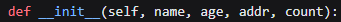

# python 基础语法


**小细节**

生成随机数：random.randint 是生成整数随机数（左右都包括），random.uniform 是生成小数随机数，random.rand 是 0-1 的随机数（包左不包右）

列表推导式：new_x_list=[x.append(1) for x in x_list]。简化书写，把后面循环的每一个变量传递给前面的变量

判断数据类型：isinstance(my_list , list)。返回一个 bool 类型的值

- 对于 for 循环，while 循环，if 语句，函数等来说，python 使用缩进代表层次关系，如果你在缩进语句下加了一行不符合缩进规则的代码，则解释器会认为这行代码下面的代码不属于上面的层级
- 如果双引号之间包括了双引号，就用单引号来代替。
- 对 if key in dict.keys 是一个判断语句，有这种语法，一个元素是否在元组里面
- 还有 if "/" not in title。这些语句都是数据容器常见的语法，在里面，不在里面


## 基础概念


**注释：**

- 单行注释：快捷键 ctrl+/，#号加一个空格，例：# 这是单行注释
- 多行注释：pycharm 无快捷键，例：""" 这是多行注释 """


**变量** ：

按明白说法就是指一个盒子里面放的东西，盒子就是变量。按专业来说就是一个执行计算机的引用地址。


**数据类型**：

- int, string, float, bool
- 用type(**变量**)函数可以查看所属类型
- 转换数据类型int(变量)用的是强制转换


**标识符：**

标识符就是让变量和方法名命名规则的一个**规范**

1. 标识符只能有字母，数字，下划线，中文不推荐，组成，但命名开头不能是数字和下划线。
2. 对大小写敏感，可以用驼峰命令
3. 命名规范，见名知道意思，小写，单词用下划线分开。
4. 不能用关键字命名如：for。


**运算符：**

- 算术运算符：+，-，*，/，//，%，**。其中//是取整除，如 9.0/2.0=4.0；两个星代表的是乘方
- 赋值运算符：=，+=，-=，*=，/=，//=，%=，**=。用法不再赘述，简化运算
- 比较运算符：==，!=，>，<，>=，<=。
- 逻辑运算符：and，or，not
- 按位运算符：<<，>>等等


**字符串：**

字符串是每个编程语言的重点，python 主要注意：

1. 字符串的定义：单引号，双引号，三引号
2. 字符串的拼接：可以使用+号进行拼接，但是效率不高
3. 字符串在 print 语句中的表现
   - 字符串的格式化方法 format。利用"姓名是{name}，年龄是{age}".format("张晗",19)
   - 使用 print()语句中的逗号，print("str1","str2")。这种方式输出的中间有空格
   - 使用+号拼接的方式，print("str1"+num1+"str2")
   - 使用占位符的形式，类似于 C 语言，print("这是字符串拼接%4.2f"%num)，代表输出占四位，保留两位小数，输出的是 float 类型，常见的类型还有%d(decmical 十进制整数),%s(字符串)。如果值超过 1 个，就用()包裹，中间用,号隔开
   - 使用内嵌变量的方式，类似于 JS，print(f"这是内嵌变量的演示{num2}")，这个是原样输出,num2 也可以替换成表达式


## 判断和循环


### if 语句

if 语句的结构基本有三种，注意语法跟其他语言不太一样，语法如下

- if-else 语句
- elif 语句
- if 语句的嵌套。我认为这个的应用场景是不用写 elif，层次感强一点，或者说第 n 层的嵌套语句中有很多个执行后也需要一起执行的代码时，我写的猜数字游戏。虽然我感觉还是没啥用。

```python
# if-else语句
a = 5
if a > 10:
    print("a的值大于10")
else:
    print("a的值小于等于10")

# elif语句
if "str1" == "str2":
    print("python亡了")
elif "str1" == "str1 ":
    print("字符串用==号判断时忽略空格")
else:
    print("字符串用==号判断时忽略空格")

# if语句的嵌套
a = 1
b = 2
c = 3
if a < b:
    print("a已经小于b了")
    if a < c:
        print("a也小于c")
else:
    print("a不小于b")
```


### while 循环

while 循环语句适合使用没有初始条件的场景，一但找到目标，就可以直接打断。while True

```python
# 猜数字案例，while语句跟if语句的嵌套结合使用
random_num = random.randint(1, 100)
count = 1
guess_num = int(input("请输入一个猜的数字："))
while 1:
    if guess_num == random_num:
        print(f"恭喜你，你在第{count}次猜中了")
        break
    else:
        if guess_num > random_num:
            print("大了")
        else:
            print("小了")
        count += 1
        guess_num = int(input("请输入一个猜的数字："))
```


### for 循环

for 循环与 Java 语言不太相同，但是跟增强 for 类似，遍历元素，格式为 for x in str:这个 str 可以是字符串还有 range()函数，range 函数的调用是 range(0,20)，就是 x 的值会一直从 0-19，左闭右开。

**for-in 遍历的时候，那个 data 并不能改变原有的值**。比如说 for data in my_list:这个时候你再做任何操作都不影响 my_list 里面原来的值。

for 循环可以跟 while 循环嵌套使用，对于 continue 和 break 关键字，和 Java 一致，以下是代码示例。

此外就是 print 语句中一些扩展知识：

- 在代码中加入\t 制表符会代表代码自动会缩进一行，对于格式的对齐尤为重要
- 如果 print()函数内不想自动换行，可以使用 print("str1",end='')
- 在代码在可以加入\n 表示自动换行
- print()语句单独使用表示换行

```python
# for循环和while循环相互嵌套，输出九九乘法表
# 定义控制行的变量
row = 1
while row <= 9:
    # 定义控制列的变量
    column = 1
    # column就代表每一列,row代表第n行
    # 相等于while里面的column<=row
    for column in range(1, row + 1):
        print(f"{column}*{row}={row * column}\t", end='')
    print()
    row += 1
```


## 函数

1. 函数就是为了简化程序代码，便于代码的重用性和简洁性所设计的。函数满足三个条件：提前写好的，可重用的，实现特定功能的代码段。
2. python 中的函数关键字是 def，弱类型语言，传参和返回参数都不用指定类型，由于作用域的关系，在函数体内部如果想要更改外部变量的值或者让外部代码访问到函数内的变量，只需要在函数中用 **global** 关键字修饰。
3. 对于函数的返回值，如果函数没有写 return 语句，返回值也是可以接收的，值为 None，类型为 NoneType，也可以手动返回 None。在变量初始化的时候，也是可以直接给初值为 None 的。代码如下
4. python 特别喜欢嵌套（if 语句，while 循环，for 循环），函数也可以嵌套，调用方式是在函数内部调用另一个函数是并发执行的，而非并行。调用函数的时候，要注意**函数代码一定要写在调用者上面**，不然程序访问不到函数就会报错。

```python
# 带有参数和返回值的函数调用
status = "张晗单身"


def my_message(sex):
    global status
    if sex == "女生":
        status = "这个女生爱上了dy"
        print("欢迎来到哈尔滨理工大学！\n您的导游是dy")
    else:
        print("欢迎来到哈尔滨理工大学，请自行参观")
    # 如果是女生这个也可以不写，status变量已经被改变了；如果是男生就会返回None
    return status


result = my_message("女生")
print(result)
```

### 函数的拓展知识


python 由于是弱类型加上一些其他的特性，真的是让我蛋疼，python 里面的语法特性简直了，以下是函数拓展的知识

- 函数的多返回值。python 中的函数返回值可以返回多个**不同类型**的数据，不同数据之间用英文逗号分隔，在函数调用处接收的时候，用多个变量接收即可，中间用英文逗号分隔。

- 函数的传参方式。

  - 位置参数。根据参数位置传递参数，就是普通的传参。
  - 关键字参数。根据键值对的形式传递参数，可以把最后一个形参利用 k=v 形式在实参传递时候写成第一个。在跟位置参数混合调用的时候，**一定要写在位置参数后面**，并且不要重复赋值，不会覆盖会直接报错。混合使用时候聊胜于无。
  - 缺省参数。不传递参数值的时候会使用默认的参数值，在函数定义时候，缺省参数一定要定义在最后面。格式为 age=11,gender="男"。
  - 不定长参数。普通不定长定义形参时候是*args，在函数内想要处理的时候外面传入的参数被保存在元组中了，直接根据下标调用就可以。对于键值对不定长形参是**args，（如 name="张晗"）是存在了一个字典中，调用时候通过键调用就可以了。传递的时候 name="张三",age=19......

- 函数作为参数传递和**lambda**匿名函数。

  - 函数作为参数传递。形参定义时候正常定义，不用加括号。调用时候函数名(args1,args2,...)调用就可以了。不同与传统传参的方式，传的是函数，是一段逻辑，之前传的是数据。

  - lambda 匿名函数是在函数调用时候需要一个函数作为参数传递的时候使用。避免重复定义，应用很广泛。lambda 格式为 lambda 形参 1,形参 2：函数体,会自动 return 值，并且不能换行。

    ```python
    # lambda匿名函数，参数值是函数
    def print_data(compute):
        data = compute(1, 2)
        print(data)
    
    
    # lambda格式为lambda 形参1,,形参2：函数体
    # 会自动return，不能换行。
    print_data(lambda x, y: x + y)
    ```

    

```python
# 1:演示函数的多返回值
def evaluate_looks(name):
    if name == "dy":
        return "zhanghan is very handsome", "我给他的颜值打10分", 10
    else:
        return "你很丑", "我给你的颜值打0分", 0


# 用三个参数接收数据
is_handsome, evaluate, level = evaluate_looks("张晗")
print(is_handsome)
print(evaluate)
print(level)


# 2:函数的传参方式(关键字参数，缺省参数)
def print_stu_info(name, age, gender, idol="dy"):
    print(f"这个学生叫{name},性别是{gender},{age}岁了，偶像是{idol}")


# 利用关键字参数给age赋值
print_stu_info("dy", 19, gender="男")  # 这个学生叫张晗,性别是男,19岁了，偶像是张晗


# 利用不定长参数传参
def compute_add(*args):
    result = 0
    # 打印一下args的值和类型
    print(f"args的值是{args}，数据类型是{type(args)}")
    # 传入的参数不确定，所以直接遍历元组
    for x in args:
        result += x
    return result


# args的值是(1, 2, 3)，数据类型是<class 'tuple'>
# 6
print(compute_add(1, 2, 3))

# args的值是(1, 2, 3, 4, 5)，数据类型是<class 'tuple'>
# 15
print(compute_add(1, 2, 3, 4, 5))

dirt = {"张晗": 18, "李四": 19}
for x in dirt:
    print(x, dirt[x])


# 不定长传键值对
def stu_score(**args):
    # 此时args是一个字典
    for x in args:
        print(f"{x}:{args[x]}")


# 传递三个人的数据，输出结果：
# name:张晗
# age:19
# gender:男
stu_score(name="dy", age=19, gender="男")
```

### 递归

递归就是一种函数自己调用自己的语法，在解决复杂问题的时候找到他们的共性，然后分割成子问题进而求解。需要注意的是，递归一定要有初始条件。

```python
# 演示一个简单的递归程序
# 本来是直接遍历文件里面的所有文件的，所以我们要引入python中文件操作的相关方法
import os.path


# os.listdir()是操作系统模块的一个方法，主要返回一个列表关于这个目录下的文件和文件夹
# os.path.exists()是判断路径是否存在
# os.path.isdir()是判断文件是不是个目录
# 此外还有很多对文件操作的方法

def get_files_recursion_from_dir(path):
    file_list = []
    if os.path.exists(path):
        for f in os.listdir(path):
            new_path = path + "\\" + f
            if os.path.isdir(new_path):
                file_list += get_files_recursion_from_dir(new_path)
            else:
                file_list.append(new_path)
    else:
        print(f"指定的目录{path}不存在")
    # 需要注意一定要把这个函数执行完的结果，这个列表返回出去，不然会报对象错误
    # 这个也是递归出口，遍历完所有的文件就会退出
    return file_list


# 调用以下方法，传入d盘的路径
file_list = get_files_recursion_from_dir("D:\\大学课程\\操作系统")
# "D:\大学课程\java"

print(file_list)
listdir = os.listdir("D:\\大学课程\\java")
print(type(listdir))
```

## 数据容器

数据容器就是数据在 python 里面的存放容器，类似于 Java 的集合，数组等等，以下是这几类常见的数据容器的介绍

### 列表

**两个列表可以直接相加得到一个新列表**

*把列表中的每个值转成多个参数

列表类似于数组？但是又有很多供他使用的方法。列表的特点是存储很多元素（2^63-1），支持索引（数据有序），允许重复，可以修改，可以存储不同数据类型的数据。当然，在列表中嵌套其他容器也是可行的，比如说列表里面再存列表。

- 定义方式：列表的字面量是[]，定义空列表有两种方式；my_list=list(); my_list=[]
- 列表遍历直接 for x in my_list 即可，x 就代表列表中每一个元素。

常见方法：增删改查

| 调用方法                  | 作用                                                         |
| :------------------------ | :----------------------------------------------------------- |
| my_list.append(ele)       | 向列表尾部中追加一个元素                                     |
| my_list.extend(container) | 将数据容器中的数据全部追加到列表尾部                         |
| my_list.insert(index,ele) | 在指定下标处，插入指定的元素                                 |
| del my_list[index]        | 删除列表指定下标元素                                         |
| my_list.pop(index)        | 删除下标指定元素，不给下标则默认删除最后一个。会返回被删除的元素 |
| my_list.remove(ele)       | 从前往后，删除此元素第一个匹配项，返回被删除的元素           |
| my_list.clear()           | 清空列表                                                     |
| my_list[index]=ele        | 把指定元素的值更改一下                                       |
| my_list.count(ele)        | 统计此元素在列表中出现的次数                                 |
| my_list.index(ele)        | 查找指定元素的下标，找不到报错 ValueError                    |
| len(my_list)              | 统计容器中有多少元素                                         |

```python
my_list = [2, 4, 5, "dy", "李四"]
# 增加元素
my_list.append("唱跳rap")
my_list.extend([6, 7, 8])
my_list.insert(1, 3)
# [2, 3, 4, 5, 'dy', '李四', '唱跳rap', 6, 7, 8]
print(my_list)

# 删除元素
# 删除李四这个元素
del my_list[5]
# 删除最后一个元素，他会返回值
pop = my_list.pop()
print(pop)  # 8
# 指定元素的值删除
my_list.remove(2)
# [3, 4, 5, 'dy', '唱跳rap', 6, 7]
print(my_list)

# 更改元素
my_list[4] = "打篮球"
print(my_list)

# 查找元素
# 查找张晗的数量
count = my_list.count("张晗")
# 统计列表的长度
len = len(my_list)
print(f"dy有{count}个,列表长度是{len}")
# 查找打篮球的下标
my_list_index = my_list.index("打篮球")
print(my_list_index)
```

### 元组

元组跟列表的唯一差别就是不可修改。所以它对应的方法也只有查找的方法。统计数量和找下标，也可以通过下标访问元组中的元素

- 元组的字面量是（），定义空列表有两种方式；my_tuple=tuple(); my_tuple=()
- 列表遍历直接 for x in my_tuple 即可，x 就代表元组中每一个元素。
- **在定义元组的时候，如果元组中只有一个元素，需要在后面加上一个逗号，不然解释器会识别出字符串**

#### 字符串

字符串可以说是数据类型中最重要的一个了。对于 python 中的字符串，特点如下

- 只可以存储字符串
- 长度任意
- 支持下标索引
- 允许重复字符串存在
- 不可以修改（因此每次对字符串操作都是创建一个新串）

对字符串的操作是重中之重，相应的方法有很多，以下只列出几种常见的方法

| 调用方式               | 作用                                                         |
| :--------------------- | :----------------------------------------------------------- |
| s[index]               | 根据索引取出相应的字符                                       |
| s.index(little_s)      | 查找小串在大串中的第一个匹配项的下标                         |
| s.replace(str1,str2)   | 将 s 里面的所有 str1 全部替换成 str2，得到一个新的字符串     |
| s.split(str)           | 按照 str 这个字符串进行分割，不会修改原有字符串，得到一个新列表 |
| s.strip() s.strip(str) | 不传参的时候去除空格和换行符，传参的时候去除所有指定字符串   |
| s.count(little_s)      | 统计小串在大串中的出现次数                                   |
| len(s)                 | 统计字符串的字符个数                                         |

### 序列的切片

序列的切片应该是 python 独有的功能了吧，非常好用。应用场景是截取指定字符串，反转字符串，range 函数里面也用了步长为负数的思想。

语法是：字符串/元组/列表[起始下标：结束下标：步长] 表示从序列中，从指定位置开始，到指定位置结束，得到一个新序列。

起始下标和结束下标可以留空，起始下标留空视为从头开始，结束下标留空表示截取到结尾

步长表示依次取元素的间隔。默认为 1，步长为 N，表示每次跳过 N-1 个元素取。步长为负数，表示反向取（开始下标和结束下标也要反向标记）

```python
# 得到指定数据
s="我是dy，我很emo，浪费好多时间啊啊啊"

# 得到ome这个数据
# 倒着取的话从右边开始数，默认从0开始，步长为1是连续取
new_s=s[11:8:-1]
print(new_s)

# 实现字符串的倒序
# 需要注意字符串和元组都是不能更改的，所以处理结果是新的字符串
reverse_s=s[::-1]
print(reverse_s)
```

### 集合

集合跟前面最大的不同是存取无序（不支持下标索引）,集合也不允许重复元素，但是集合可以修改。

集合的字面量是{}，定义空集合的方式是 my_set = **set()**，没有 my_set={}，这是由于这个定义方式被字典占用了。

集合的常见方法如下：

| 方法调用形式                       | 方法作用                                                     |
| :--------------------------------- | :----------------------------------------------------------- |
| my_set.add(ele)                    | 往集合中添加一个元素                                         |
| my_set.remove(ele)                 | 移除集合内指定的元素                                         |
| my_set.pop()                       | 从集合中随机取出一个元素                                     |
| my_set.clear()                     | 清空集合                                                     |
| my_set1.difference(my_set2)        | **得到一个新集合**，内容是两个集合的差集(A-B)，原集合内容不变 |
| my_set1.difference_update(my_set2) | 操作原理一样，只不过不再生成新集合，而是修改 my_set1(A=A-B)  |
| my_set1.union(my_set2)             | **得到一个新集合**，内容是两个集合的和集，原集合内容不变(A+B) |
| len(my_list)                       | 求集合的元素数量                                             |


```python
# 定义两个集合
my_set1 = {1, 2, 3, 4, 5}
my_set2 = {1, 2, 3}
difference = my_set1.difference(my_set2)
union = my_set1.union(my_set2)
# 求集合一的长度
len = len(my_set1)
# 两集合的差集是{4, 5}，两集合的和集是{1, 2, 3, 4, 5}
print(f"两集合的差集是{difference}，两集合的和集是{union}")
print(f"集合一的长度是{len}")
# for循环遍历数据，遍历出来的是集合的元素
for ele in my_set1:
    print(ele)
```

### 字典

字典是基于键值对的数据容器。**字典中的 key 不能重复（重复添加会覆盖），并且模式是根据 key 检索 value，所以字典不支持下标索引，但是可以更改。**

由于可以嵌套使用的特点，导致字典的功能特别丰富，字典里面的 key 不能为字典，其余都可以。比如说存储学生信息的时候，用 key 存储学生姓名，对应的 value 存储以列表的形式再存储学生的年龄，成绩等等信息。

字典的字面量是{}，跟集合的一样，但是中间格式需要是 key:value 的形式。定义空字典 my_dict={}，my_dict=dict()。调用的时候用 my_dict[key]调用。

| 操作               | 说明                                                         |
| :----------------- | :----------------------------------------------------------- |
| my_dict[key]       | 获取指定 key 对应的 value 值                                 |
| my_dict[key]=value | 添加或更新键值对                                             |
| my_dict.pop(key)   | 取出 key 对应的 value 并删除此 key 的键值对                  |
| my_dict.clear()    | 清空字典                                                     |
| my_dict.keys()     | 获取字典中的全部 key，可用于 for 循环遍历字典(存在一个<class 'dict_keys'>数据结构当中了) |
| my_dict.values()   | 获取字典里面的全部值                                         |
| len(my_dict)       | 计算字典中的元素数量                                         |
| my_dict.get(key)   | 获取对应的 value，如果不存在，就会报错，相当于直接用下标访问 |

```python
# 定义一个字典，键都是字符串，对应的值一个是列表，一个是字典
my_dict = {"dy": ["男", 18, "唱跳rap"], "李四": {"性别": "男", "年龄": 18, "爱好": "打篮球"}}

# 添加一个元素，小君君
my_dict["小君君"] = "女"

# 获取字典中的所有key
# dict_keys(['dy', '李四', '小君君'])
keys = my_dict.keys()
# <class 'dict_keys'>，单独的一个数据结构
print(f"字典中获取的全部key存到了{type(keys)}里面了，内容是{keys}")

# 遍历字典并打印
# dy=['男', 18, '唱跳rap']
# 李四={'性别': '男', '年龄': 18, '爱好': '打篮球'}
# 小君君=女
# 遍历出来的是key
for key in my_dict:
    print(f"{key}={my_dict[key]}")
```


## 文件的操作

### **文件读写操作**

1. open函数打开文件
2. 中间操作。。。。
3. close函数关闭

文件的读写操作需要先用 open 函数打开文件，close 函数关闭文件，此外 python 提供了 with-open 语句来自动关闭文件，语法如下

- open(name,mode,buffering,encoding)。

  - name 表示文件名，文件名如果是路径，注意转义字符，如果是单独的文件名，需要在当前包或者模块下存在。如果 mode 指定的是 w 或者 a 模式，会自动创建。
  - mode 参数表示模式，有三种模式 r(read),w(write),a(append)，传递的时候用字符串传递。
  - buffering 参数表示缓冲区大小，初学不用指定用默认就可以。
  - encoding 表示字符编码，默认都是 utf-8，当然有需要也可以使用 GBK 等。如果 buffering 不指定参数，那么 encoding 需要用关键字参数指定。

- close()函数。文件名直接调用就可以，f.close()，一般结合异常处理 try-except-finally 语句使用。

- with-open 语句。避免忘记关闭文件，格式为：

  with open(name,mode,buffering,encoding) as f:

   下面要写的逻辑......

  f 是文件对象


### 文件读取操作

需要注意的是，如果程序刚开始读取了文件，下一个读取方法会从文件结束读取的位置开始读。如果读完了，下一个方法读出来的就是空，就算文件中有多少数据都没用。

常见方法：

- read()方法，一次全部读取，可以传入参数，代表一次读几个字节
- readline()方法，一次读取一行，返回值是读取的内容
- readlines()方法，把文件中数据按行读取并存储在列表中。（注意：\n 也会读取到，一般采用 strip()方法去除）
- for line in 文件对象。按行读取，会读取到换行符。

```python
f = open("a.txt", "r", 1024, encoding="utf-8")

# 先改成写的模式往文件里面写点数据
# f.write("我是dy\n")
# f.write("我很帅\n")
# f.write("天才少年尘宸")

# reads = f.read()
# 会把换行符一并读取
# print(reads)

# line = f.readline()
# print(line)

# lines = f.readlines()
# print(lines)

# for循环读取
for line in f:
    line = line.strip()
    print(line)
```

### 文件写入和追加操作

文件写入的时候，如果文件不存在，会重新创建，如果文件不存在，就清空原有内容。因此引入了 append 追加模式。

文件写入的时候写入的方法有：

- write(data)方法：往文件里面写入内容。返回值是写入的字符长度
- flush()方法：把缓冲区的数据刷新到硬盘中。
- close()方法：关闭文件，内置了 flush 功能。

文件追加写入跟文件写入基本一样，创建文件时候把模式设置成追加模式就可以了。追加模式的特点是写入文件时候不会覆盖前面的文件了。

```python
# 往文件里面写点数据
# 打开文件
f = open("dy.txt", "w", encoding="utf-8")

# 往文件里面写入数据
f.write("dy是个19岁的帅哥\n")
f.write("身高一米八五\n")
f.write("很多女生都喜欢他")

# 如果文件不刷新，数据不会写入到硬盘中，而是先在缓冲区中
# 但是好像python新版不刷新也能写进去了
f.flush()

# 关闭文件流,内置了flush功能
f.close()

f = open("dy.txt", "a", encoding="utf-8")
# 这个时候因为前面文件已经关闭了，然后可以用f，再写入一行会追加进去
f.write("\n但是dy一心向学")
```


## 异常处理


对于异常处理可以说每个编程语言都有的模块了。在实际开发中也是必不可少的模块，因为当出现异常的时候我们往往不希望程序直接停下来，而是想要它们在日志中给出错误信息后还可以继续运行。对于 python 的异常处理如下

- 捕获常规异常：采用 try-except 语句，捕获的是全部异常，但是不能获取异常对象。

- 捕获指定异常：在 except 语句后面指定异常名即可。

- 捕获多个异常：在 except 语句后面指定异常名并且多个异常用小括号包裹。

- 捕获全部异常：指定异常的时候指定一个最大的异常，Exception 异常。

  except 语句后面可以加个 as e 获取异常对象（常规异常不指定异常名不可以）

  try-except-else-finally 语句：else 后面跟的逻辑没有出现异常的时候会执行，finally 后跟的逻辑出不出现异常都会执行

  **出现异常以后 try 后面的语句就执行不了了，如果再有异常也不会被捕获**

```python
# 在这个python文件中演示各种异常是如何捕获的

# 捕获常规异常，不指定异常名，不能获取异常对象
try:
    a = 1 / 0
except:
    print("出现异常了")

# 捕获指定异常
try:
    open("a.txt", "r")
except FileNotFoundError as e:
    print(f"出现了文件未找到异常，异常的提示信息是{e}")

# 捕获多个异常
try:
    open("b.txt", "r")
    # ZeroDivisionError
    a = 1 / 0
    # NameError
    print(name)
#     异常用括号包裹，逗号分割
except (FileNotFoundError, ZeroDivisionError) as e:
    # 如果有两个异常，则程序默认捕获到第一个就不执行了（会执行下面的except语句），第二个异常不会捕获
    print(f"出现了文件未找到或者除0异常，异常提示信息是{e}")

# 捕获所有异常
try:
    c = 2 / 0
except Exception as e:
    print(f"出现了未知异常，异常提示信息为{e}")

# try-except-else-finally语句
try:
    # print(1)
    print(sex)
except Exception as e:
    print("出现异常了我会执行")
else:
    print("没有出现异常时候我会执行")
finally:
    print("有没有异常我都会执行")
```


## 类和对象

采用 class 关键字声明，对属性赋值采用引号赋值或者等号，方法访问类中的属性采用 self 关键字调用。类中方法定义的时候需要传入一个参数 self，self的作用类似于java的this。

实例化直接student=Student()就实例出一个对象


```python
# 创建一个简单的person类，实现吃饭喝水等功能
# 演示类和对象的基本语法
class Person():
    name = None
    age = None
    sex = None

    def eat(self):
        print(f"{self.name}在吃饭")

    def drink(self):
        print(f"{self.name}正在喝水")

    def per_info(self):
        print(f"姓名：{self.name}，年龄：{self.age}，性别：{self.sex}")


person1 = Person()
person1.name = "dy"
person1.age = 19
person1.sex = "男"
# 调用person1的打印方法看看属性是否添加进去
person1.per_info()
# 调用普通成员方法
person1.eat()
person1.drink()
```

### 构造方法



跟java的无参和有参数构造一样

```python
# 定义一个类
class Student:
    name: None
    age: None
    addr: None
    count: None

    # 第4个参数是用来标识第几个学生
    def __init__(self, name, age, addr, count):
        self.name = name
        self.age = age
        self.addr = addr
        self.count = count
        print(f"学生{self.count}信息录入完成，信息为【学生姓名：{self.name}，年龄：{age}，地址：{addr}】")


# 采用循环方式创建学生对象录入信息
for s in range(0, 3):
    name = input("请输入学生姓名")
    age = input("请输入学生年龄")
    addr = input("请输入学生地址")
    student = Student(name, age, addr, s + 1)
print("3个学生数据创建成功！")
```

### 魔术方法

```python
# 演示那4个魔术方法，以student对象演示
class Student():
    name: None
    sex: None
    age: None

    def __init__(self, name: str, sex: str, age: int):
        self.name = name
        self.sex = sex
        self.age = age

    # 以指定格式返回字符串
    def __str__(self):
        return f"姓名是：{self.name}，性别是：{self.sex}，年龄是：{self.age}"

    # 重写eq方法，更新比较逻辑。
    # 按照姓名和性别相等就认为这两个对象相等
    def __eq__(self, other):
        return self.name == other.name and self.age == other.age

    # 重写lt方法
    # 规定按照年龄大小排序
    def __lt__(self, other):
        # 可以返回大于，表示谁年龄大，谁对应的对象就小，当然一般用小于号，指定的属性谁小对应的对象就小
        return self.age < other.age

    # 重写le方法
    # 这个包含相等比较
    def __le__(self, other):
        return self.age < other.age


# 实例化三个学生对象用于演示魔术方法
student1 = Student("dy", "男", 19)
student2 = Student("李四", "男", 20)
student3 = Student("王五", "男", 21)
student4 = Student("dy", "女", 19)

# 开始调用魔术方法
# 调用对象转换成字符串，直接打印对象即可
print(student1)

# 判断对象相等，学生1和学生2姓名和年龄都不相等，因此False，学生1跟学生4姓名和年龄都相等，因此True
print(student1 == student2)
print(student1 == student4)

# 判断哪个对象大,学生3最大，因此为True
print(student3 >= student2)
```

## 三大特性

### 封装

封装主要就是私有和公有和保护的区别。

- 对于私有成员，只有类内部可以访问，它的子类和外部均不能访问，不能通过导入的方法来调用保护成员。格式是成员名前面加_ _

- 对于保护成员，只有类内部和他的子类可以访问，外部不能访问，并且不能通过导入的方法来调用保护成员。格式是成员名前面加_

- 对于公有成员，都可以访问。

- 调用父类的方法的时候，一定是 **super()**再.变量或方法名

  

### 继承

继承是子类可以继承父类的属性和方法。格式是定义类的时候在类的括号里面加上父类名。支持多继承。

 继承属性的时候会把属性的默认值也给继承下来。可以重写属性和方法，会覆盖的

 多继承的一个特性是继承的属性和方法如果有重名的，以括号里面越前面的类的属性为准

 需要注意继承的时候哪些变量和方法是直接继承下来的。哪些是可以访问的，哪些是禁止访问的。（私有公有保护的区别）


### 多态

多态是配合继承实现的。这里引入抽象类和 pass 关键字的概念

- 抽象类。只定义规则但是并不具体实现的类叫做抽象类。
- pass 关键字。如果函数体或类体不写逻辑并且需要满足语法规则不报错，写一个 pass。

这个时候就引入了多态的概念，实现这个抽象类的方式就是继承这个类，去重写里面的方法。然后如果方法有参数需要传递这个抽象类的对象的时候，我们并不传递抽象类的对象，而是传入一个抽象类的子类对象，这个现象叫做多态。可以是多个子类对象

