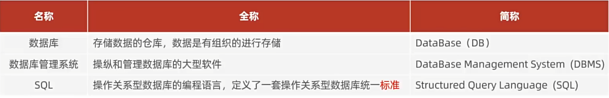
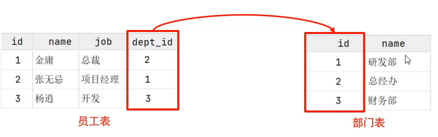
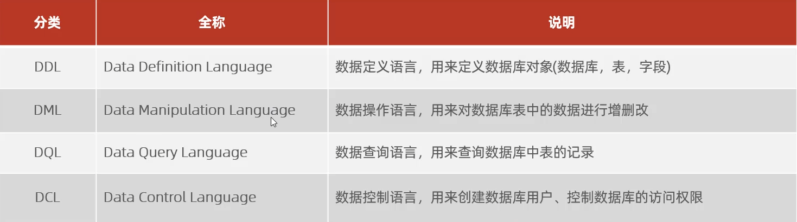
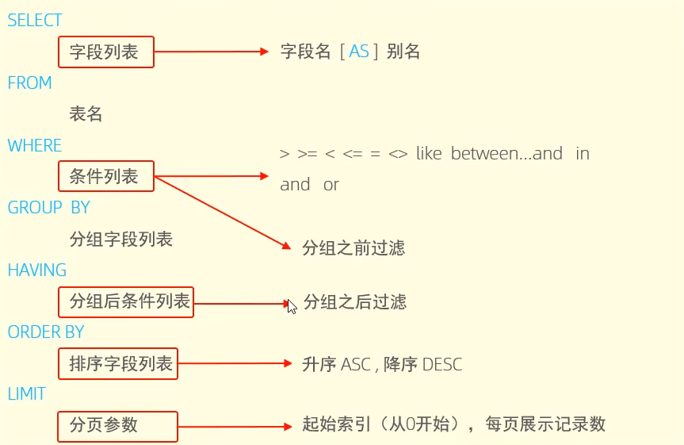

# 基础

## 数据库相关概念

数据库主要就是用来存储数据的仓库，而数据库管理系统就是用来怎么管理数据的仓库的工具或者软件，SQL语句就是用来构造执行如何操作数据库的执行流程。

**流程图**

人操作数据库管理系统—>执行SQL—>数据库—>拿到数据并返回

## 数据库类型

关系型

非关系

**关系型数据库**：

1. 二维表式存储数据，字段对应，容易维护
2. SQL语句操作简单

## SQL分类

1. DDL用作数据库和表的结构
2. DML用作表数据修改
3. DQL用作表数据查询
4. DCL用作权限

### DQL语句

**执行顺序：**先去form查询某表—》where查询条件—》再group分组和having—》返回要查询的字段—》排序—》分页

### 分页

分页的格式：select * from 表名 limit (起始页-1*显示页数),显示页数;

## 多表查询

- 一对多
- 多对一

多对一和一对多其中只要有一个字段连接就可以了

- 多对多
  - 多对多要用一个中间表来连接两表的关系

### 多表查询分类

#### 连接查询

- 内连接

  查询两表交集的数据

- 外连接

  左连接：查询左边表所有数据和两表交集的部分数据

  右连接：查询右边所有数据和两表交集部分数据

- 自连接

  自己与自己连接，但必须使用表别名

#### 子查询

**联合查询**

就是把查询结果然后在放到一个查询语句里面做查询

## 事务

事务本质就是描述一组连续操作过程，要么同时成功，要么同时失败。

# 进阶

# 运维