# 第一课 不是价格在动而是美元在动

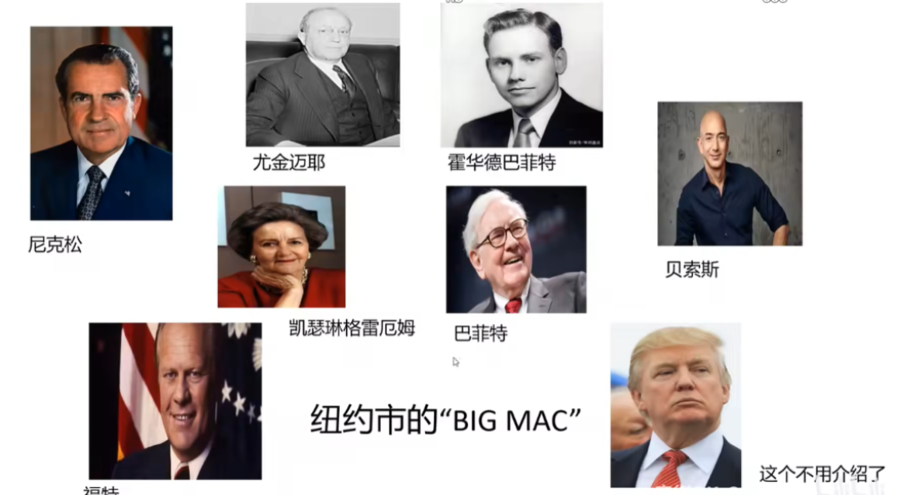

**美元在动的本质就是美国共和党和民主党之争**

- 共和党里面主要是些军火商、房地产、石油这些有钱的，喜欢放任经济美元下跌，世界混乱，然后抄底。
- 所以美国总统是什么党派执政，美元指数大方向能确立。

## 四大金句

- 金融市场中最迅速而安全的赚钱方法，是尽早察觉趋势的改变，建立头寸，顺着趋势前进，并在趋势反转之前或之后不久，了结你的头寸。
- 如果我们知道如何观察，则过去的事件可以反应未来的事件。
- 一般而言，错误并不是源自于无知，而是恐惧。（我的看法：错误来源于无知，因为你不懂所以面对问题的时候你不知道该如何操作。）
- 如果你知道何谓趋势，而且也知道它在什么时候最可能发生变化，你实际上已经掌握市场获利的全部知识了。

## 美元历史

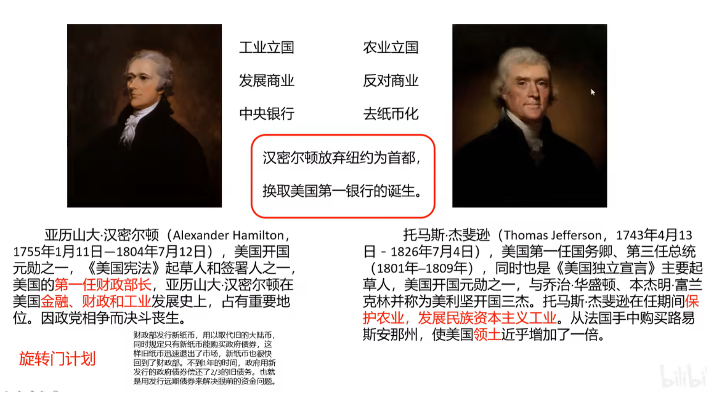

- 汉密尔顿主义华尔街是通过旋转门计划赚钱第一桶金的所以他是共和党派的。
- 杰斐逊主义是对着跟汉密尔顿主义干，是民主党派的。

## 总统选举结果判断美元走向

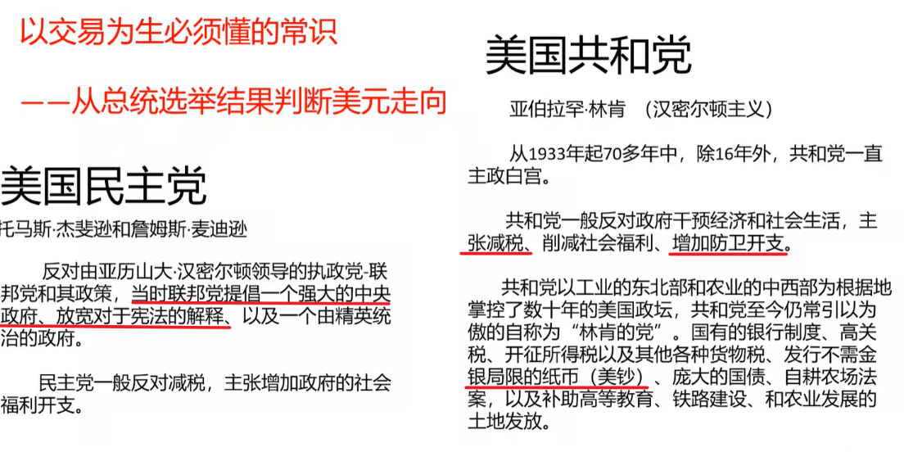

**民主党**

- 主张个各州独立财政，跟中央对着干。
- 我的观点：回顾这几年川普上台好像确实美国有闹过分裂的新闻。
- 主张低关税

**共和党**

- 主张减税：共和党有钱人多不想交税。
- 增加防卫开支：里面大多数有军火商小布什也是共和党的。
- 大量发行纸钞：QE
- 主张高关税

## 买美元是为了买什么？

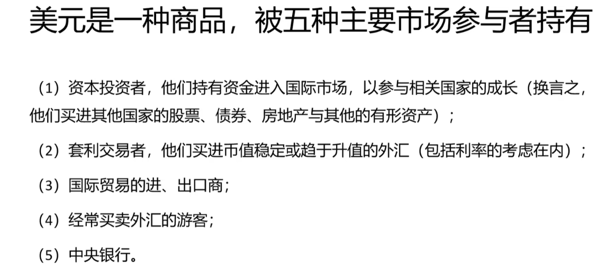

- 外汇储备
- 外贸出口的
- 套利的交易者

`无节制的财政，终将导致美元指数创新低。`

## 欧元区vs美元区

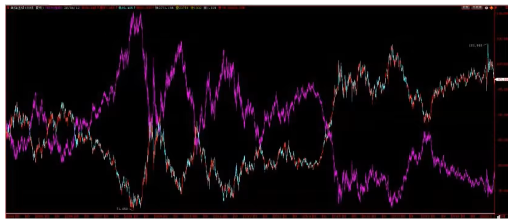

- 世界财富区分美元区和欧元区对着干
- 如果你的国家挂钩美元那就是站队美元区。如果中立，那就是偏向欧元区
- 美国主要对手不是中国，而是欧洲(最近的俄乌战争)。

## 美元与石油挂钩

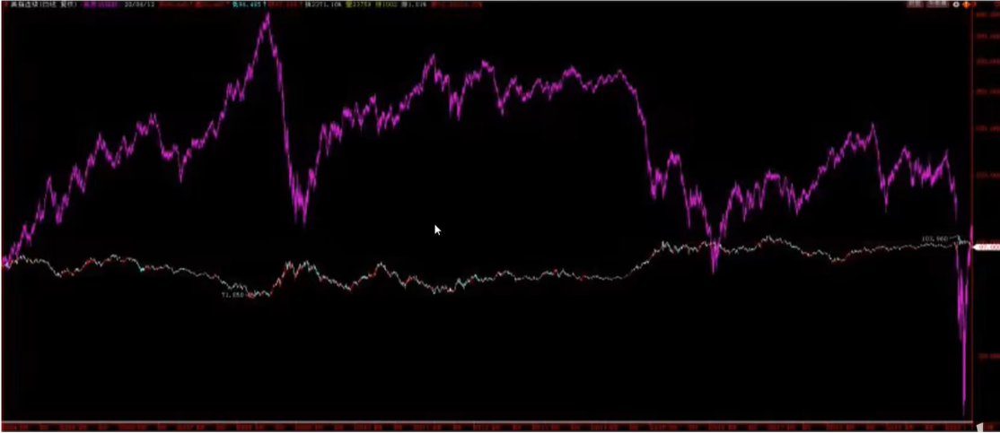

**美元可以买石油，那个国家不用美元买石油就会有大规模杀伤性武器，美军就会过去军事演习。**

## 美元与黄金

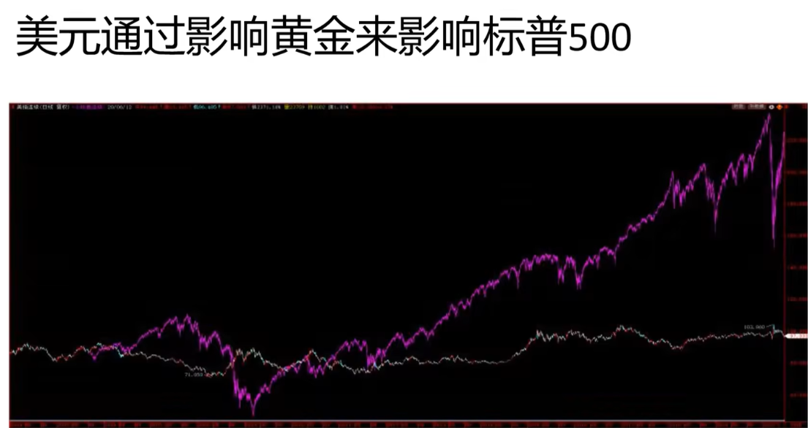

- 美元与黄金是负相关的状态
- 华尔街交易员们喜欢交易黄金来对冲标普500（意思是涨太多了买一下黄金来对冲）**有套利关系不太懂。**

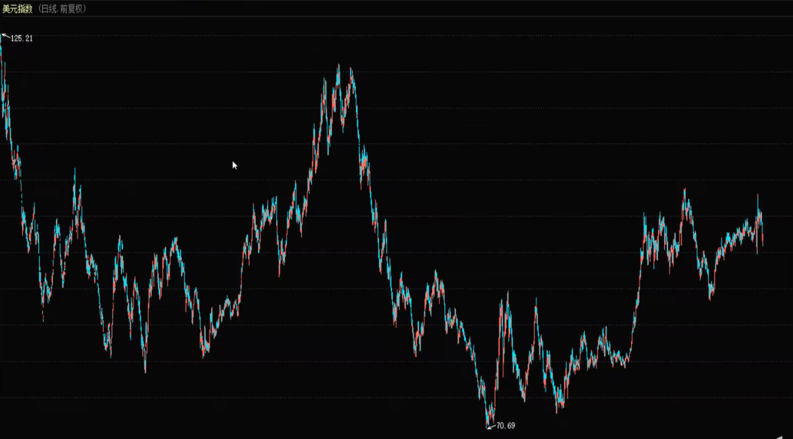

- **美元100是平价**
- 美元上升的时间是民主党执政，下跌是共和党执政。
- 现在如果川普能连任美元指数是倾向与下跌的意味着美元要涨过头了要下跌。

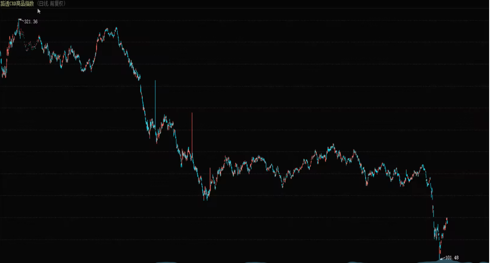

**全球庞大的债务增发太多的纸币去应对债务危机，大量的纸币去哪里吸收呢？只能去调整10年的商品期货吸收(通胀预期)。**

---

# 第二课 "投机"投的是什么机？

## 什么是投机

- 投机是一场依靠实力的运气管理

- 输赢的关键在于如何管理胜算

- 掌握胜算时便跟进，否则便盖牌，如此你便居于赢方

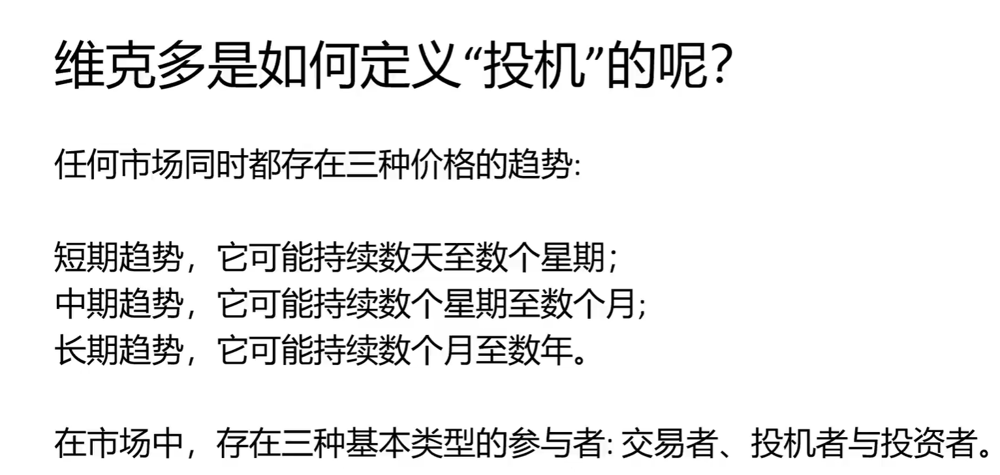

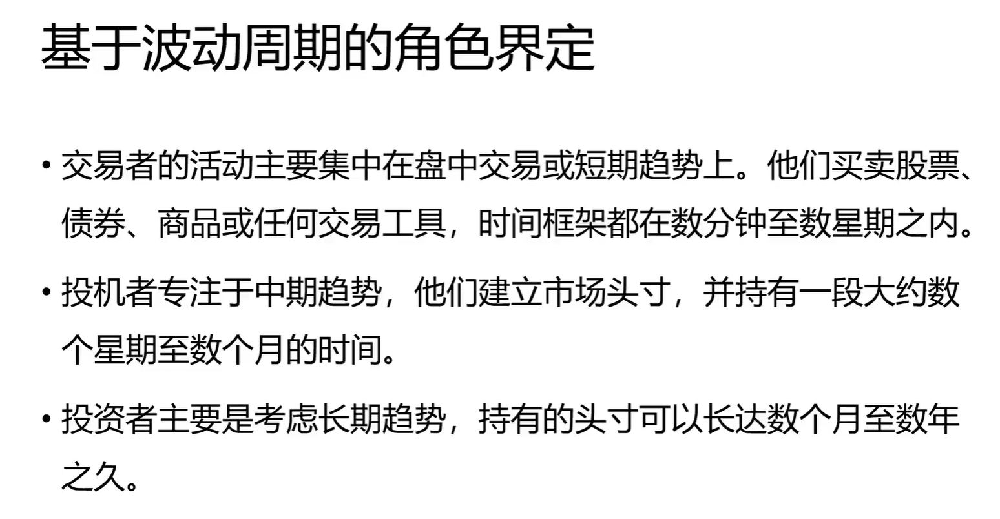

应用范围专注中期趋势，数个星期到数个月

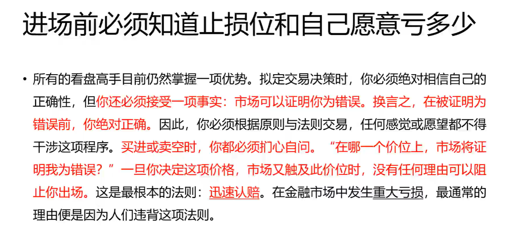

---

# 第三课 鳄鱼法则

鳄鱼法则当你知道自己犯错时候，或者买入的理由不存在了，立即认赔或离场。

## **巴菲特严格遵守鳄鱼法则例子**

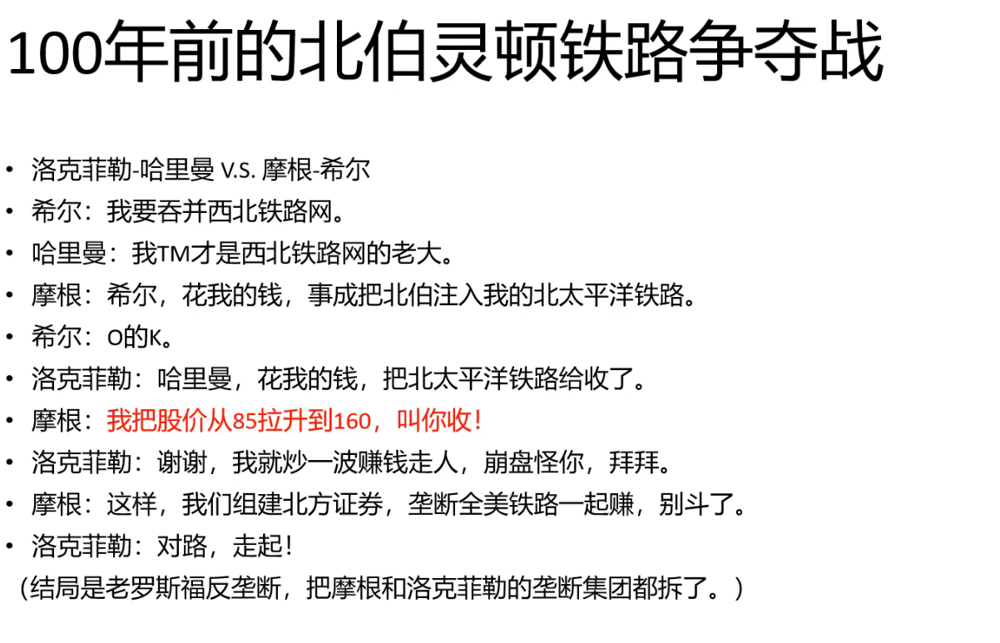

这段历史在杰西礼佛摩尔的股票作手回忆录里记载过，就是利用两家神仙打架，礼佛摩尔在其中赚了不少钱。

所以说**股票作手回忆录**讲的是礼佛摩尔在跟庄的事，在**操盘术**写的就是他自己如何操盘的。两本书是杰西的分水岭。

**美国反托拉斯的实质是新利益集团对原利益集团的财富进行隐蔽瓜分**

股神之所以是股神不是炒股厉害，而是官商勾结厉害。

08年站队奥巴马，作为回报找个理由“铺设石油管道不环保”禁止铺设原油管道使得原油只能用铁路运输

到川普上台哪管你这些，直接铺石油管道，从此柏林顿铁路货运量下降。

### 庄家吸货

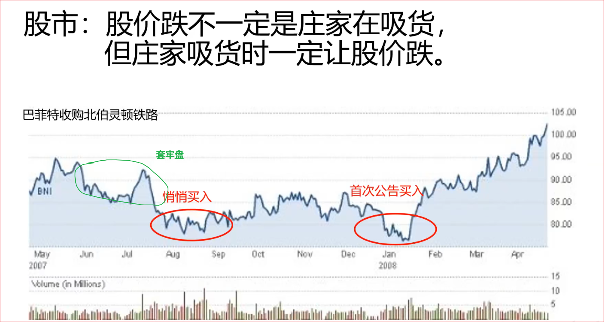

巴菲特认为七十多块价格可以了就买入，就会呈现下跌的过程中突然来个反弹，说明有庄家在进去收货了。

但是股价一直没突破85块上方的套牢盘。一直耐心的跌下来继续收继续收。最终可以看到下边搞了个横盘震荡。

然后08年因为金融危机股价暴跌，这时候巴菲特站粗来说要把北伯灵顿铁路私有化。

`这也说明了某个个股如果不跟着大盘下跌，其中很大可能就是庄股`。

### 为什么铁路股和航空股做法不一样？

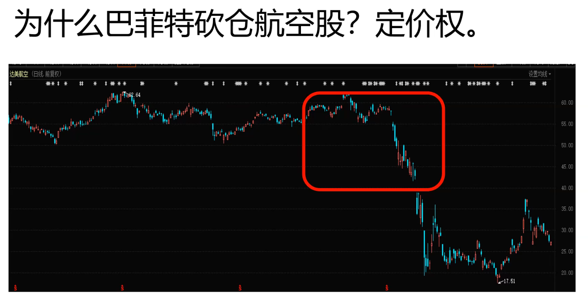

因为巴菲特不知道航空股背后有大庄。自己没有定价权，无法控盘，所以买确定性，卖不确定性，不然亏死。

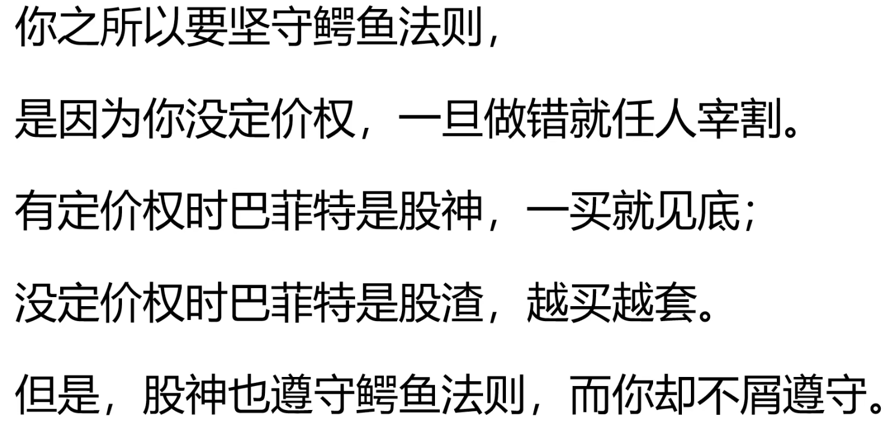

----

# 第四课 批判地继承道氏理论

## 三大假设

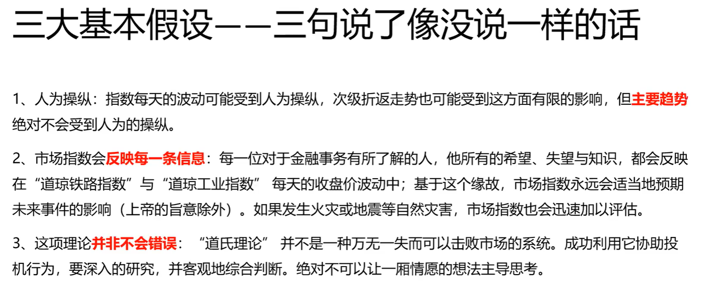

**都是胡扯投资要有确定性**

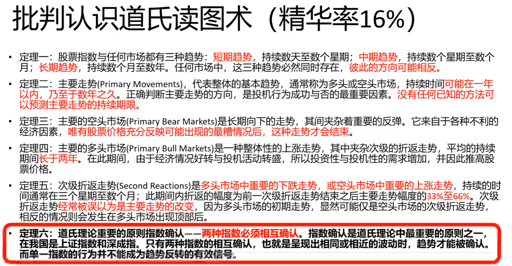

只有**定理6**有用

## 股指的作用

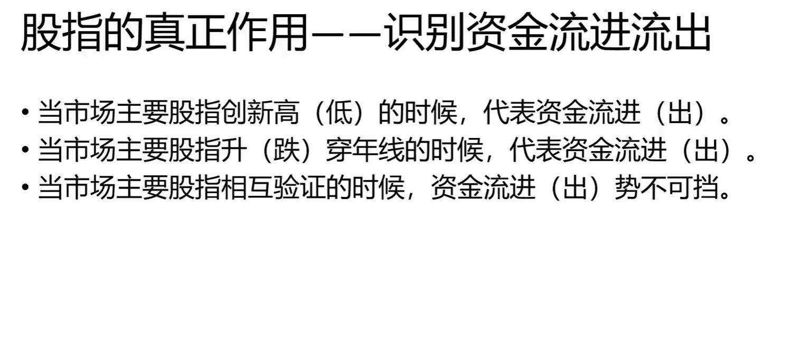

---

# 第五课 趋势

趋势的重要性顺势而为

顺势提高胜算的策略错可能就错一次

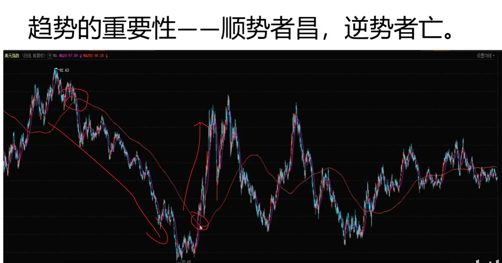

- 投资者看区间，相对低位买，相对高位卖。
- 投机者看趋势，搞清楚市场的主要矛盾是什么，
- 知道市场错在哪里，买在泡沫起来时，右侧做多，左侧做空，同一市场中可以互相替代品种的相互验证。
- 交易者看成交量，放量的时候才高抛低吸。

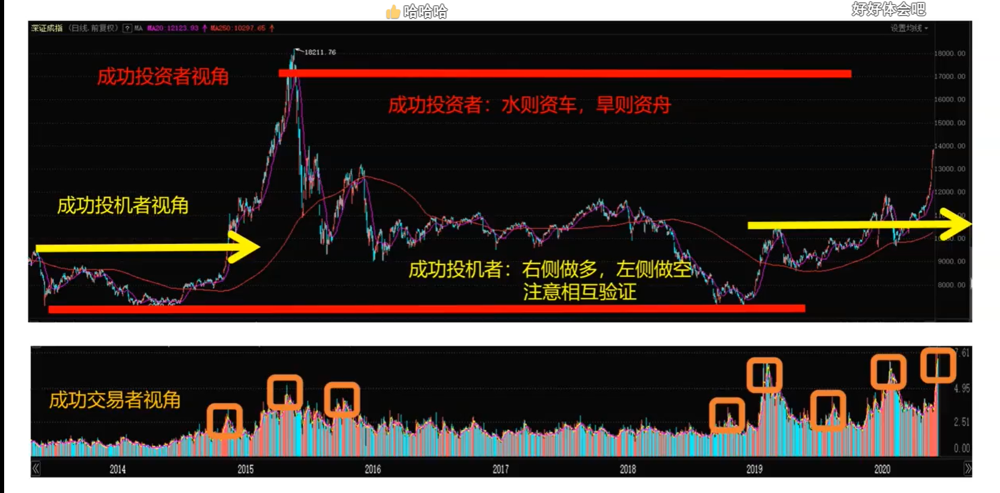

# 第六课 如何逃顶？

## 斯波朗迪眼中的三类市场参与者

- 波浪观察者：趋势是你的朋友，上涨做多，下跌做空，对赌大从，杰西·利弗莫尔这样的右侧交易者
- 人为操作者：通过制造抛压或买气来影响价格短期趋势，机构利用股指期货对现货卖不出去用来套保的
- 纯技术派：试图通过技术分析预测未来，操作获利

## 2B法则

- 在上升趋势中，如果价格已经创新高而未能持续上升，稍后又跌破前高点，则趋势可能发生转变。
- 下跌趋势亦然

意思就是市场在单边趋势反正是一件很小概率的事，大概率是冲不了前高或者冲过前高又跌破前高点趋势可能就发生反转了。

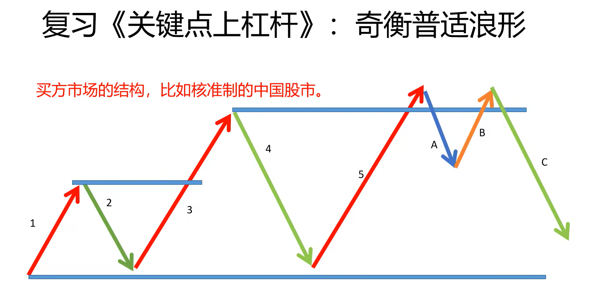

当市场出现2B反转的时候要规避风险，如果之后趋势中正常，在A,B高点位置在重新买回来。

## 2B结构实图

**2007年牛市高点**

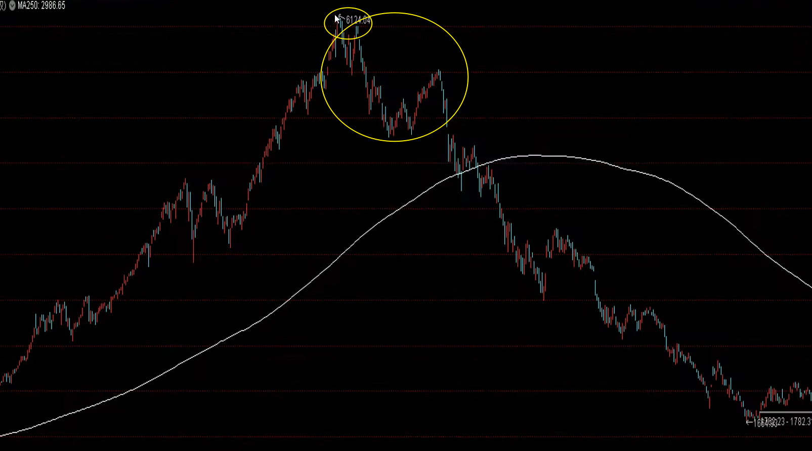

**2009年**

**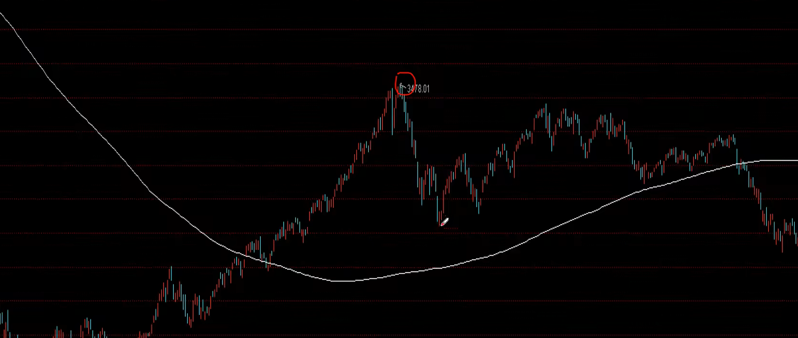**

发生急跌之后创新高未能持续

**2010年眉飞色舞**

用2B结构判断做多或做空，但不要轻易抄底(尤其是杠杆抄底)

**2015年杠杆牛**

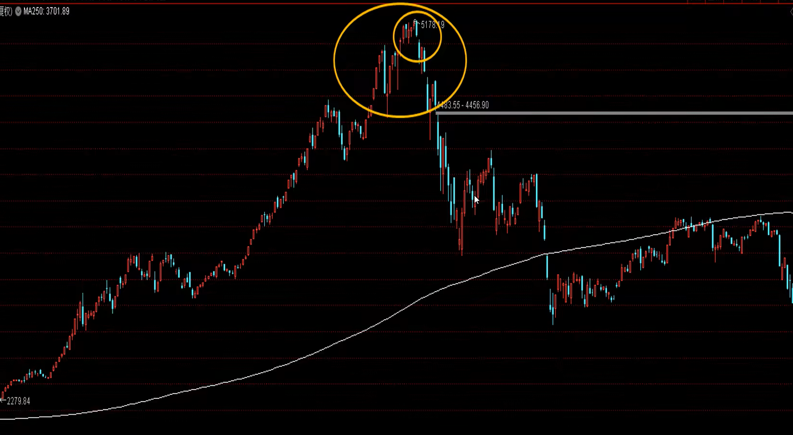

这就是2B规避风险，无论怎么看只要有风险一定要先规避及时落袋为安。

**2016年熔断**

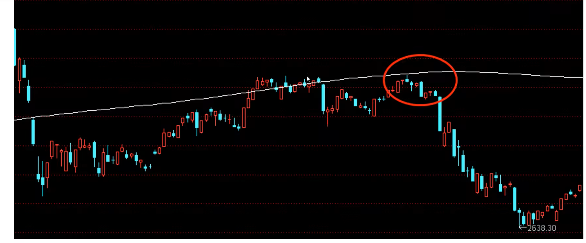

年线下方没创前高，年线下方是空头格局应该低仓位飞行。

## 总结

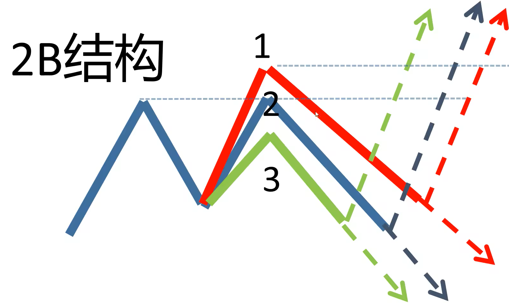

三种情况

- 第一种是创新高
- 第二种是与前高持平
- 第三种是创都没创直接下跌

无论那种情况，如果下跌都依靠前高或前低先出来再说，等到重新创新高的位置买回来就就行了

## 如何做？

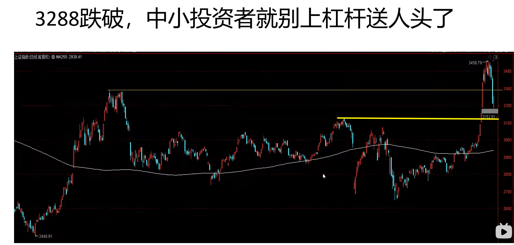

1. 首先判断趋势
2. 然后再看年下上方还是下方，还在上方说明现在还是多头格局
3. 上穿矩形回踩箱底，看能否站住黄线的高点。

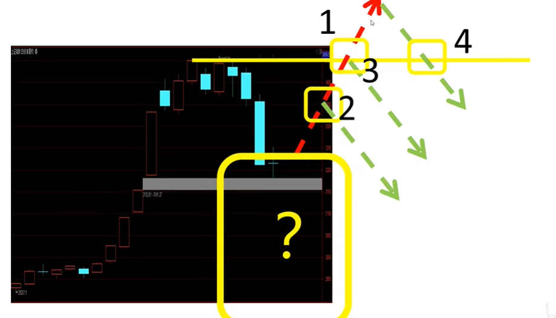

最后看反弹的力度决定如何处理卖还是买

# 第七课 交易守则

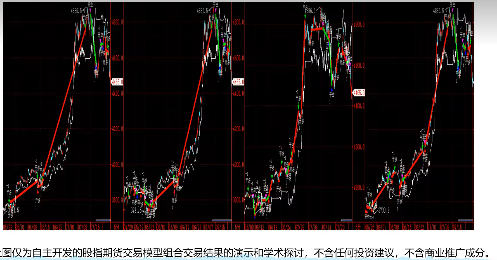

## 守则1

根据计划进行交易，并严格遵守计划。

首先必须决定你的时间结构。

- 当然冲销？（头寸建立与结束都在同一天之内）
- 短期交易？（持有天数至数个星期）
- 中期投机？ （持有数个星期至数个月）
- 长期投资？  （持有数个月至数年）

## 守则2

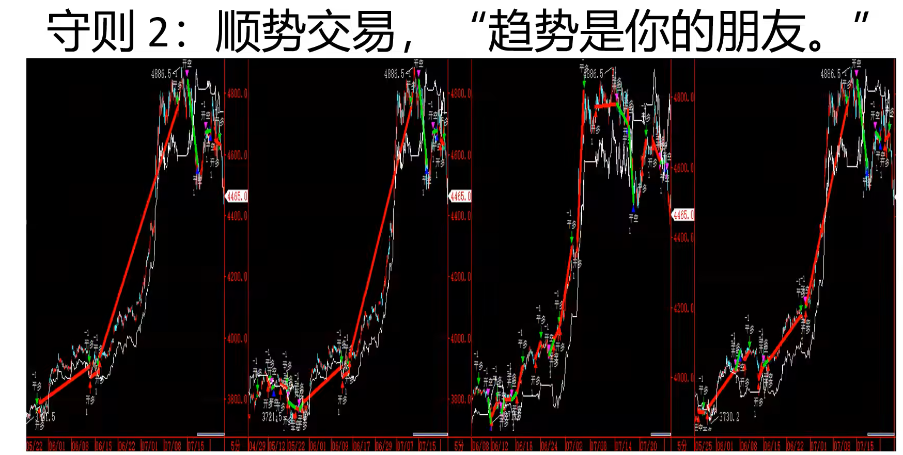

进场出场要有一致性

## 守则3

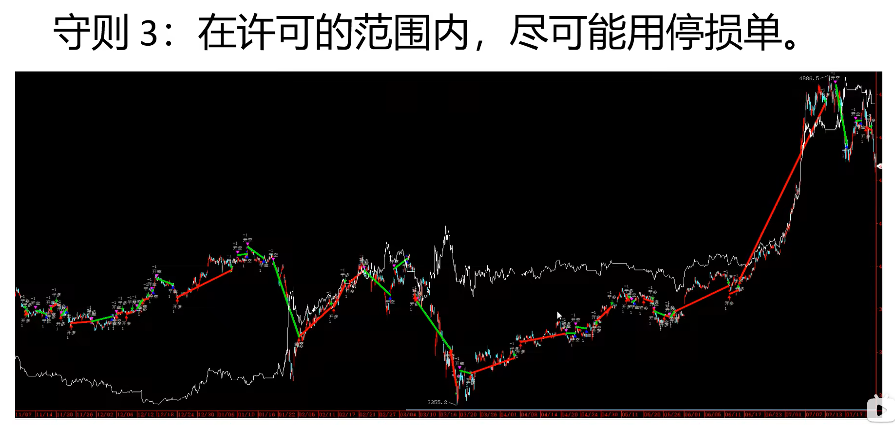

切勿频繁交易

## 守则4

一旦心在怀疑，立即出场！

## 守则5

务必要有耐心，不可过渡扩张交易

## 守则6

迅速认赔让获利头寸持续发展

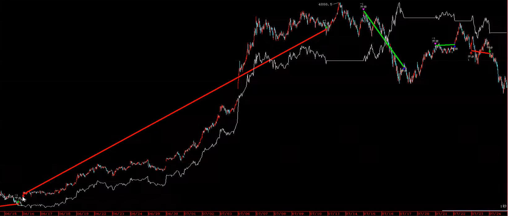

## 守则7

不可让获利头寸演变为亏损。或者尽可能持有获利头寸。

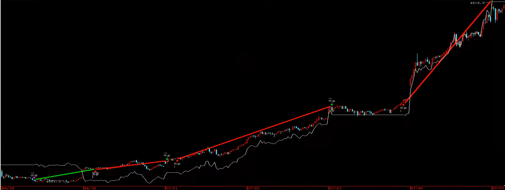

要保护价上移

## 守则8

在弱势中买进，在强势中卖出。应该以买进的意愿来同等对待卖出。

## 守则9

在多头市场的初期阶段，应该扮演投资者的角色，在多头市场的后期与空头市场中，应该扮演投机者的角色。

## 守则10

不可摊平亏损--亏损头寸不可加码

在空头市场里面做短线

可以定投抄底但一定要经历过崩盘

## 守则11

不可仅因为价格偏低而买进。不可仅因价格偏高而卖出。

5分钟结构图

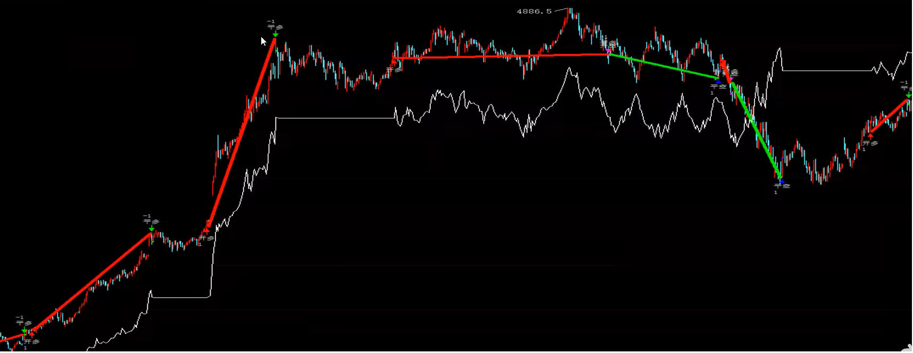

## 守则13

价格变动迅速时，不可建立头寸。

## 守则14

不可根据特殊情报交易。换言之“顺势交易”，而不是顺着朋友的意见、另外，不轮你对某支股票或某个市场有多么强烈的感觉，也不可以提供或某个市场有多么强烈的感觉，也不可以提供免费消息或意见。

## 守则15

永远得分析自己的错误。

## 守则16

务必提防“错误的并购消息”

## 守则17

如果一笔交易的成功与否，必须取决于交易指令的正确执行，则不该从事该笔交易。

## 守则18

必须保留自己的交易记录

## 守则19

了解、并遵守法则

- 对于每1条交易守则，作至少有5种方法违背它，而且交易者总是会想出新的方法。依次推理，我列举18项交易守则，你至少应该有90种方法违背它们。每当你违背一项交易守则，你又发现一种亏损的新方法。

# 第八课 只有在高流动性的市场交易

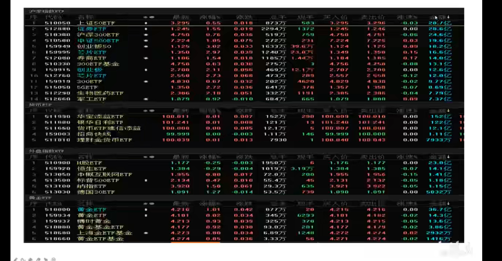

流动性看成交金额

要在高流动性的地方你才有赚钱概率大

高流动性指的是月线持续放量

**个股**

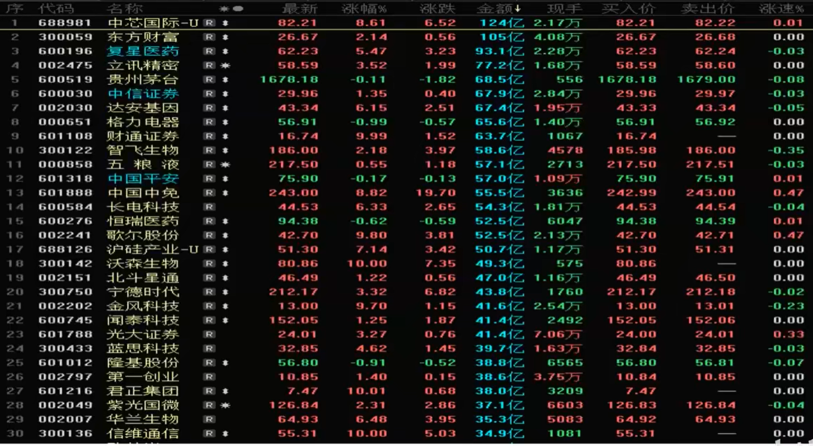

# 第九课 交易像减肥，大部分人会失败告终

- 情绪与理性同时主宰人类行为
- 情绪与理性互不关联，需要独立操控
- 情绪盯着看得见的东西，理性聚焦看不见的东西
- 解决方案：备忘录，量化算法，回忆痛苦经验

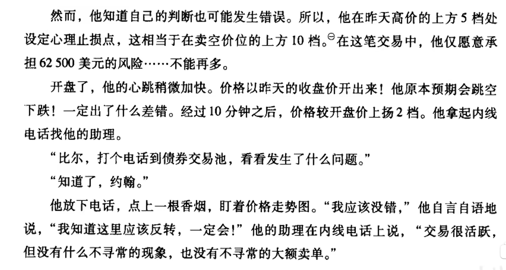

按理说行情见顶交易是很稀薄的，也没有不寻常的大额卖单说明日本国家队根本没有抛售债券。

# 第十课 一开盘，祖先给的本能都丢了

## 方法1：减法

- 理念：当A和B是一个硬币的两面时，没有证据A发生，那么我们默认现在处于B状态。
- 常见误区：找证据证明现在处于A还是处于B。
- 应用：当一个国家的主要股指处于年线上方的时候，无论是不是牛市，都当作牛市来做；处于年线下方时，无论是不是熊市，都当作熊市来做。

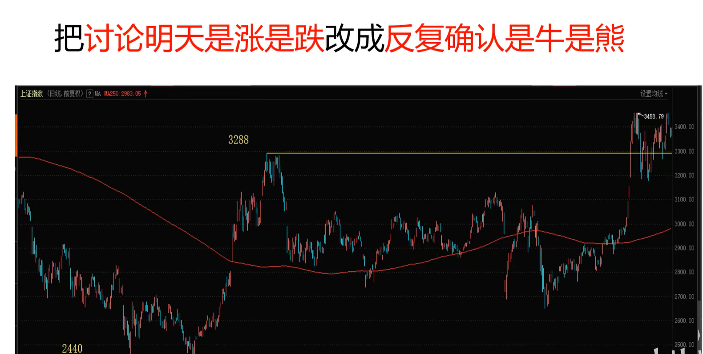

## 方法2：校验

- 理念：指数相互验证
- 应用：当一个国家处于（牛熊）的时候，它的主要股指方向都相同

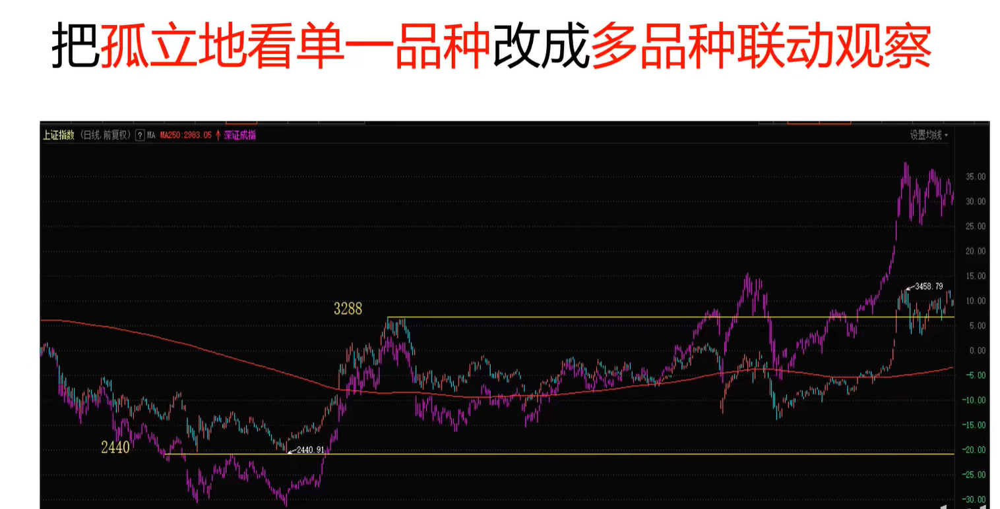

## 方法3：底线

- 理念：有退有据
- 常见误区：持仓没底线
- 应用：大级别周期下。前期高点和前期低点作为重要参考

## 总结

- 以少胜多--做减法
- 以全克偏--做校验
- 以静制动--设底线

# 第十一课 维克多三大指导原则

1. 大体而言，市场走势是基本经济力量运作的结果，后者又是政治活动与决策的后果。

   - 以板块为例--政策改变基本面

     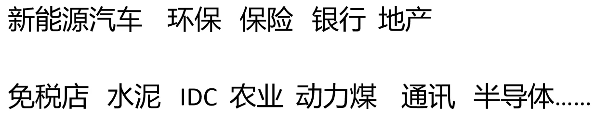

2. 如果我们知道如何观察，过去的事件可以反映未来的事件

   - 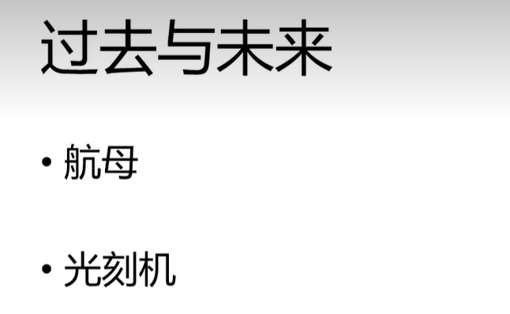

3. 在市场中获利的关键，是判断既有的错误信念，观察它的发展并在他人尚沉迷于这些错误信念时，采取果断的行动。

   - 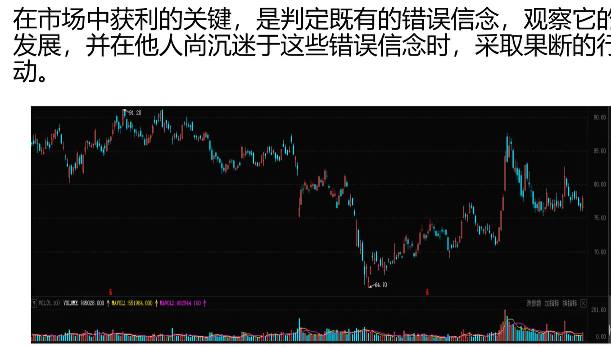

# 第十八课 技术分析(下)

## 从“我近日为什么卖出比亚迪”讲起

- 索罗斯他说过他成功的秘诀是先找到市场的错误,然后发现这个错误正在形成泡沫的刚开始时候赶快找机会进场，在所以人意识到错误之前赶快离场。

- 历史新高即是风险也是机会，因为有套牢盘，突破历史新高阻力最小路线向上。

- 后续上涨还是下跌，无法预测
- 关键问题在`特斯拉`（全球电动车龙头坐标原则）

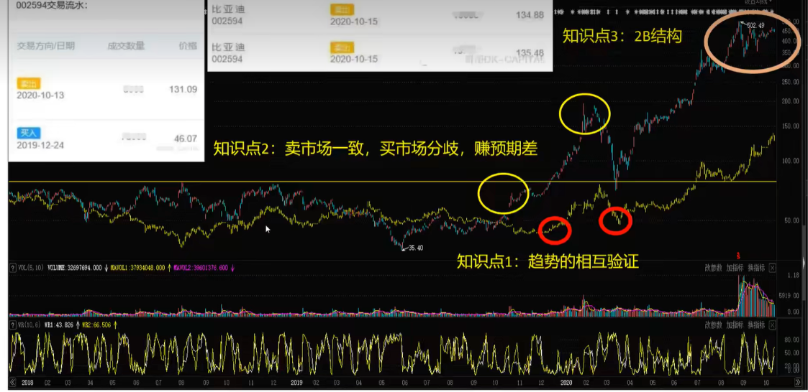

- 业绩与股价齐飞要注意警惕(金融行为学)

- 彩蛋：威廉指标下穿流畅度

## 操作特斯拉逻辑

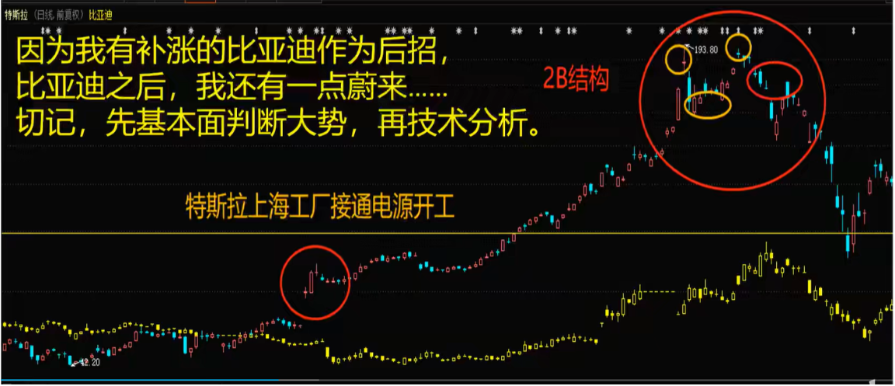

### 基本面分析

- 特斯拉在中国打开市场能带来业绩爆发，类似于当年苹果进军中国市场。
- 炒完斯拉第一波由于是全球龙头，所以人们要在全世界选择一个对标的新能源汽车公司，用第一来估第二类似饿了么和美团运用了坐标原则。

### 技术面分析

- 预期差：美国那边不知道特斯拉上海接通电源，在中国借钱把美国贷款还了，随后美国机构那边做空的要止损，做多的要加仓两股势力齐力推升跳空这个缺口。
- 用2B法则来判断离场时机

- #### 第一浪的判断

  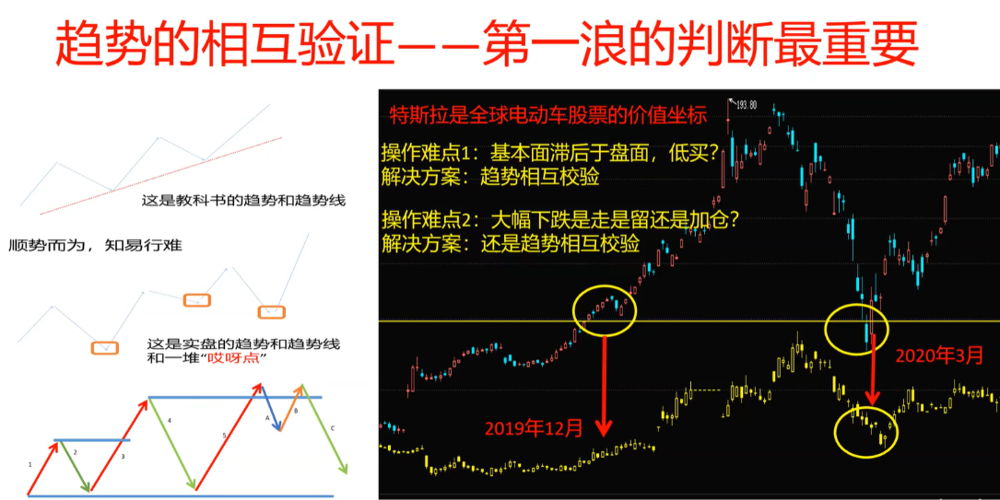

  ​	

  - 行情启动点为第一浪
  - 比亚迪回撤到第一浪稍微小破一下然后迅速回升确认第二浪加仓

  **为什么特斯拉(黄图)跟比亚迪的价格走势一样？**

  因为特斯拉是全球电动车股票价值坐标，按格雷厄姆的证劵分析来说，你不能用A来判断A的内在价值，但你可以用A来判断B的相对估值。所以有了基本面判断大势，在用术分析特斯拉，来操作比亚迪。当特斯拉回调到第一浪起点正好对应了5浪结构的2浪。此刻管理三七二十一加仓再说。

  

### 特斯拉的五浪造型

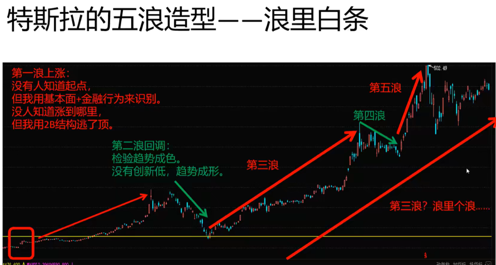

五浪有时间函数的

**什么意思？**

就是五浪时候看起来很清晰，当时在当前时间周期里没走出来算当前周期的五浪我的理解

举个例子：

在图片可以看出清晰的五浪结构，但是只要3,4,5浪在后面跟大的周期可能回调到第二浪可能也算作第三浪。

### 2B结构本质

本质就是**创新高的失败**

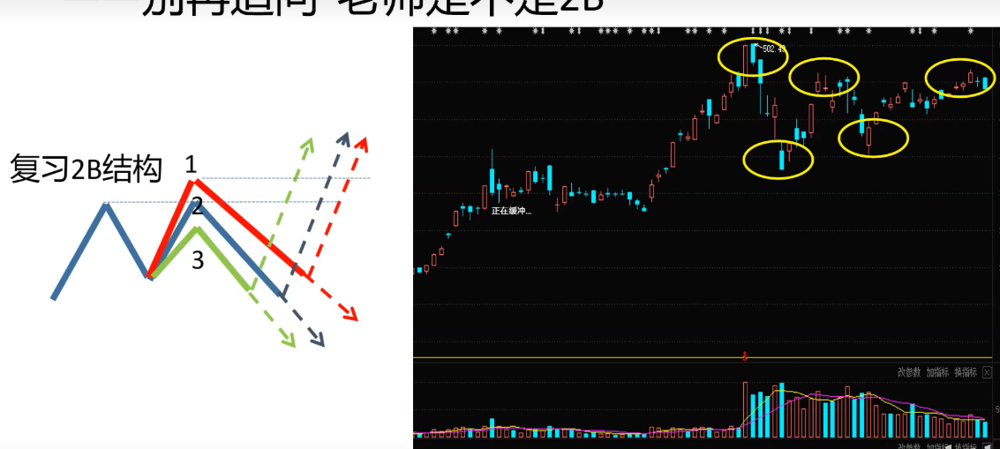
