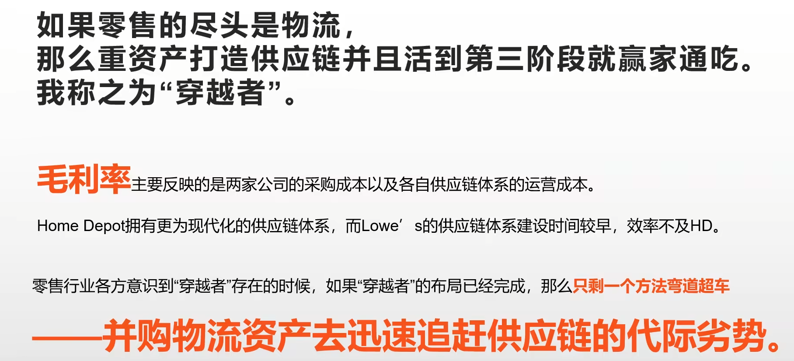

# 零售业

## 7-11不是便利店

> 单独守住一个点短时间可能没事，长时间必败。站边可以定位出企业战略是什么打法。

### 定位

> 可以看出7-11SKU拼不过折扣店，他相当于在便利店和折扣店的融合。
>
> 既提供便利，又提供SKU。差异化竞争

### 与便利店的区别

7-11通过多SKU不赚钱引流，然后卖半成品高毛利的预制菜来获利。这就有个问题消费者买账吗？

7-11是连接供应方和消费者的一个渠道。由于自己不是自产自销原材料成本降不下去，开的地方得是那种收入门槛高的CBD提供便利，可以溢价收取高毛利。

### 不可能三角博弈

- to S 面向供应链扩大采购压倒进价成本(省出来的钱)
- to C 面向消费者产品敢于涨价(有实力)
- 周转获利形 只做爆品做不大

### 如何破解不可能三角

在原有的两条边低成本-高周转率的基础上，在其他地方收费，卖会员收服务费来获取高毛利。

> 当然山姆店开的地方也要是人均消费得是中产多的地方。

### 7-11破解不可能三角

在新扩张的区域采用高毛利和高周转提供便利前期不获利，一旦区域达到规模临界可以向供应商压低采购价还能提高零售价这时候就可以获利了

### 阶段的策略

### 总结

从7-11战略来看针对的是针对的是人均消费高的白领，所以开的地方都是市中心提供便利。在战术阶段第一步扩张阶段由于不降价采用的是高毛利，和高周转率提供便利前期不赚钱让利给加盟商。当达到规模后采用物流配送降低成本和扩大采购降低成本。第二步提供快速新品来增加SKU获取客流量依然保留高毛利，这个增加SKU是限时限量所以周转率还算可以，低成本又可以在物流和供应商，高毛利来自消费者便利服务。

这就是7-11破解不可能三角。把这片区域的竞争者逼走自己来赚钱，赢家通吃。

## 扩张门店要轻，建供应链要重

### 家装建材行业

- 长期低频，短期窗口高频的生意
- 完整周期里不赚钱的服务行业(赚的钱补贴给不赚钱的周期)
- 真正的盈利模式在于建材批发的零售
- 家装服务为建材生意引流接单

### 发展历史

> 更好的服务是为了更好的卖产品

### 发展阶段

**第一阶段**

通过放弃高周转提供更多SKU引流客户，建材自带高毛利，不提供装修服务拿到低成本。

 

**第二阶段**

大力烧钱建立MRO业务放弃低成本，在高毛利和提升高周转率做to B的服务和配送。搞建材批发

### 竞争对手区别

家得宝面向to B 

劳氏面向to C

不仅有买卖关系还有拆解关系。供应与渠道粘性很强

### 家得宝模式为什么没能在中国市场复制

### 零售的最终模式

拼的就是谁离消费者最近，稳打稳扎重资产。

#### 建供应链配送历史

# 餐饮业

## 全食超市赢在品控还是营销

低成本高毛利超市里面品类多包括生鲜所以放弃高周转

### 发展过程

先进入一个细分市场培养第一批种子用户在扩大SKU切换到主流市场卖预制食品。

理念归理念，现实归现实，全食超市健康理念是营销针对高收入人群服务。

## 星巴克VS瑞幸战略

拆解

### 错位竞争

辛巴克类似7-11对抗折扣店一样，烧钱守中高价位咖啡市场不让瑞幸进入。

高段位竞争靠周期消灭对手而不是商业手段 

### 辛巴克模型缺陷

>  直营扩张开店，成本大量增加，而且扩张慢。烧的钱可能转不回来

> 瑞幸化

### 瑞幸如何应对

1. 开放加盟快速占领市场
2. 深耕供应链做上游出货给加盟商以转嫁通胀

7-11模式

