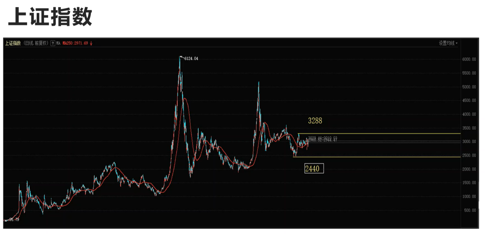

# 关键点出手

个人投资者不只要会研究庄家在想什么也要研究庄家在做什么。

## 第二章精髓

你看到 满屏幕的K线最终决定胜负的只**有一两根K线**才值得交易，其他	K线都是跑龙套，如果你在跑龙套的K线你交易那等到重大行情到来了时候，你的本金已经消耗完了。

要关键点出手，或者摆脱左侧，关键点（近几个月高点或者历史高点）

**突破3288助力方向是向上的**

# 阻力最小方向

## 如何运用阻力最小方向

上证在低利率周期货币稳健政策是在一个区间无方向运动的，如果要操作的话我会等到冲破3288或者一轮暴跌来配置。因为低利率周期下股票是涨的。

### 与深成指比较

深圳局部牛里面做的股票赢面机会大

# 上涨时做多，下跌时做空

如果你在市场恐慌、股价暴跌的时候没有现金，那么投资和投机的知识懂再多也没用

股票作手回忆录是研究盘面的，证劵分析是来研究基本面。

相当于看牌和打牌，证劵分析用来分析基本面，作手回忆录是来处理期间突然的事情。

格雷厄姆说市场是台投票机从来没说过长期来看是称重机，意思就是你不要你觉得有价值，你要看大家对这个价值认不认可或者大家极端了。

不过过早在牛市到来之前行动。

# 拨开崩盘的迷雾

基本不变那一面，内在价值稳定，导致价格惯性。

当前的阴包昨天的阳线表示否定。

从创新高之后的回调只要没有跌破一轮急促上涨的低点都算做二浪的回调释放风险。

低利率周期股价就应该高高利率周期股价就应该跌，跟债券一样。

## 加仓

杰西说的上涨加仓不是越涨越加那段

指的的是出了左侧不在创新低的时候加仓

# 你听完这节课发现自己不会炒股

## 股票

1. 每只股票背后都是一家公司
2. 公司有内在价值，假定期限和利率之后，就可以算出来
3. 股票是一种未来现金流天然不稳定的风险证劵，它在契约上就不保证还本付息。
4. 除非你能影响公司经营，否则唯一的权利就是卖股票
5. 所以股票都是垃圾，只是在一段特点时间会上涨
6. 股票都是垃圾不代表背后的公司垃圾，但好公司的股票不等于好价格有被过高的预期透支

## 平安小册子好公司

## 交易

1. 只要你的盈利来自卖出价--买入价，你就是在做交易
2. 只要你使用杠杆，你就是在做交易
3. 你的盈利来自对手亏损
4. 研究基本面是研究对手怎么想，研究技术面是研究对手怎么做。
5. 你买入，是为了卖出。因此，不利于卖出的，就不要买。
6. 在上涨时做多，下跌时做空，没有方向不动。

## 2020年原油行情

基本面是俄罗斯和沙特聊减产然后谈崩了。然后中国有一群人暴跌抄底，没有耐心现在都差不多嗝屁了

**股票收盘和隔天开盘之间发生的任何重要消息，通常都配合阻力最小路线。在消息发布前，趋势已经确立，在多头市场中，利空消息会被人忽视，利多消息会被人夸大，反之依然。**

**输家研究股票，赢家研究股民**

# 识别假突破的方法

预测下一个大波动是往上或往下毫无意义。

决定在价格突破任何方向的限制之前，不采取任何行动。投机客必须注意从市场赚钱，而不是坚持大盘必须跟你的看法一致。

唯一能让大盘上涨的就是当前供不应求。

**假突破应对就是要一笔交易试盘，然后回调的时候逐笔加仓，千万不要倒金字塔加仓最后面加越多。**

很明显看到收了下影线，有较强的阻力但也不是绝对阻力。

# 这个低抄还是不抄

- 抄一定不要带杠杆(底线)
- 定投指数基金抄底
- 倒金字塔抄底不要在缝大跌买一点
- 认真研究基本面：研究公司，研究行业，研究商业模式，研究盈利模式，研究竞争格局，研究产业链，有了这些知识后再跟庄家交手。

- 研究盘面，手绘历史日K线图，日内分时图

